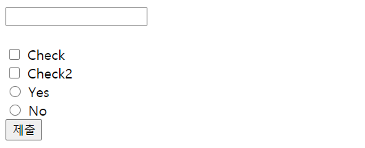

# 프론트엔드
### HTML
#### 기초 배우기
<hr/>

> HTML 이란?
+ HTML은 HyperText Markup Language의 약자
+ 웹 페이지는 HTML 문서라고도 불리며, HTML 태그들로 구성
+ 각각의 HTML 태그는 웹 페이지의 디자인이나 기능을 결정하는데 사용
</img>
</img>

> HTML 태그(tag)
+ HTML 태그는 태그 이름을 꺾쇠 괄호(<>)로 감싸서 표현
<pre>
<code>
<태그이름> 태그 ~~ <태그이름> 
</code>
</pre>
+ 보통 시작 태그(start tag, opening tag)와 종료 태그(end tag, closing tag)의 한 쌍으로 구성
+ <span style="color: gray">**\<br>, \<hr>등**과 같이 종료 태그 없이 시작 태그만을 가지는 태그를 빈 태그(empty tag)</span>

> HTML 기본 구조

</img>

+ \<!DOCTYPE html> : 현재 문서가 HTML5 문서임을 명시
+ \<html> : HTML 문서의 루트(root) 요소를 정의
+ \<head> : HTML 문서의 메타데이터(metadata)를 정의   <span style="color: gray"><h5> -메타데이터(metadata)란 HTML 문서에 대한 정보(data)로 웹 브라우저에는 직접적으로 표현되지 않는 정보   <h5>- \<title>, \<style>, \<meta>, \<link>, \<script>, \<base>태그 등을 이용하여 표현</span>
+ \<title> : HTML 문서의 제목(title)을 정의   <h5>-웹 브라우저의 툴바(toolbar)에 표시
+ <body> : 웹 브라우저를 통해 보이는 내용(content) 부분
+ \<h1> ~ \<h6> : 제목(heading)을 나타냄
+ \<p> : 단락(paragraph)을 나타냄

#### 의미론적인 HTML 작성
<hr/>

> Semantic HTML
>> Semantic HTML = HTML tag를 의미에 맞게 사용하는 것
>>> + \<div>에 클릭 이벤트를 달고 \<button>처럼 쓰는 경우 
>>> + \<aside>를 \<div class="aside">로 쓰는 경우 등

> 왜 Semantic하게 HTML을 짜야 하는가?
1. 다른 사람이 내 코드를 볼 때 편해진다.
```
<div>
    <div>
        <span>제목</soan>
     </div>
    <div>
        <div>
            <p>내용</p>
        </div>  
    </div>
    <div> 작성자 정보</div> 
</div>           
```
```
<body>
    <header>
        <h1>제목</h1>
       </header>
    <main>
        <section>
            <article>내용</article>
        </section>
    </main>
    <footer> 작성자 정보</footer>
</body>             
```
 2. 모바일 환경에서 유리하다. 
+ 코드가 짧아지니 non-semantic한 HTML보다 파일 사이즈가 가벼움
+ 태그에 기능이나 css가 내장되어있어 불필요한 구현을 줄일 수 있음

3. SEO를 위한 Semantic HTML
+ SEO(search engine optimization)은 검색 엔진이 내 페이지를 찾을 수 있도록 페이지를 최적화하는 것
+ Semantic한 HTML은 마냥 div만 작성한 코드보다 search engine에 내 페이지에 대한 정보를 더 많이 제공

</img>
<h5> <span style="color: gray">일반적인 구조의 웹페이지를 작성할 떄의 구조 </span>


#### 폼과 유효성 검사
<hr/>

> 폼이란?
+ 웹 프로그래밍의 기술의 하나
+ 클라이언트가 정보를 입력 및 선택하고, 웹 서버 등의 폼을 처리하는 에이전트로 제출하기 위한 기구

```
<body>
    <form action="" method="" enctype="">
        <input type="text" name="test"> <br><br>
        <input type="submit">
    </form>        
</body>
```
+ action 은 데이터를 받아서 보낼 url 주소를 정함
+ method 는 데이터를 GET,POST,PUT...어떤 방식으로 보낼지 정함
+ enctype 은 데이터의 인코딩 방식을 정함

</img>

> 유효성 검사
+ 어느 브라우저를 사용하는지 여부에 상관없이 그 웹페이지가 똑같이 보이고 정상적으로 작동하는지에 대한 검사
+ = 웹 표준을 지킨다는 것
+ <span style="color: gray"> 웹 표준은 월드 와이드 웹의 측면을 서술하고 정의하는 공식 표준이나 다른 기술 규격을 가리키는 일반적인 용어 </span>
+ (http://validator.w3.org/)

#### 컨벤션과 모범 사례
<hr/>

> 코딩 컨벤션이란?
* 코딩을 하는 프로그래머 사이의 규칙
> 코딩 컨벤션의 이점
* 여러명이 협업하는 과정에서 코드 스타일을 유지
* 가독성이 높아져 소스코드를 처음 접하는 사람들도 빠르고 쉽게 이해
* 유지보수에 이점
> 모범사례
> > NHN이 제시한 코딩 컨벤션
1. 네이밍 규칙: 이해하기 쉬운 이름으로 작성
2. html
* 들여쓰기 : 보통 2칸/4칸 들여쓰기를 통일
* 빈 줄 : 반 줄은 의미있는 객체를 구분하기 위해 사용되므로 남발하지 않기
* DTD 및 인코딩 : 어떤 버전의 HTML인지 어떤 문자 코드로 인코딩을 선언하는지 구분
* 주석 : html 코드의 주석은 코드 그룹을 구부하거나 참고해야 할 떄 기술    
<a href ="https://nuli.navercorp.com/data/convention/NHN_Coding_Conventions_for_Markup_Languages.pdf"> NHN 바로가기</a>

>> Daum이 제시한 코딩 컨벤션
1. 문서제목
* 컨텐츠 제목과 서비스명 사이에는 마이너스가 아닌 ' - ' (```&ndash;```)가 사용
* 하위섹션명의 구분은 |로 사용
2. 레이아웃 가이드
* 큰 레이아웃은 전체를 daumWrap으로 싸고daumHead, daumContent, daumFoot으로 쪼갬
* daumWrap을 relative하여 daumMinidum을 상단으로 올림

#### 접근성
<hr/>

> 웹 접근성이란?
* 모든 사람들에게 평등한 웹 이용을 위해, 웹 접근성이 만들어짐
* 보통 사람들과 달리 웹 이용에 불편함을 겪는 사람들은 웹의 접근성이 떨어짐
* *  이를 위해 스크린리더기, 마우스스틱 등 보조기기를 이용하는데 보조기기가 읽게 하기 위한 방법들을 통해 웹 접근성이 좋게 해야 함

> 웹 표준과 웹 접근성의 차이
* 웹 표준은 웹 접근성을 지키기 위한 표준

> 웹 접근성의 4가지 핵심 원리
* 인식의 용이성 : 모든 콘텐츠는 사용자가 인식 가능해야 함
* 운용의 용이성 : 사용자가 모든 기능에 대해 조작이 가능해야 함
* 이해의 용이성 : 모든 사용자에게 콘텐츠는 이해돼야 함
* 견고성 : 미래의 기술로도 현재의 콘텐츠를 이용할 수 있어야 함

#### 기본 SEO
<hr/>

> 검색 엔진 최적화 SEO
* 웹 사이트가 검색 결과 첫 페이지에 노출될 수 있도록 사이트를 개선하는 작업

>> 온 페이지 SEO : 웹 사이트 내에 있는 HTML 요소, 서버 요소, 핵심 키워드를 대상   
>> 오프 페이지 SEO: 웹 사이트 밖에서 활동하는 소셜 미디어, 타 웹사이트 링크 등

> 메타 태그를 통한 검색 엔진 최적화 방법
1. title
2. description
3. keywords

> 그 밖의 최적화 방법들
1. h 태그
2. 단순 url
3. 시맨틱 요소
4. robots.txt & sitemap.xml
* robots.txt : 검색 엔젠 로봇의 접근을 제어하고 관리
* sitemap.xml : 검색 엔진에 페이지 목록 정보를 제공 
