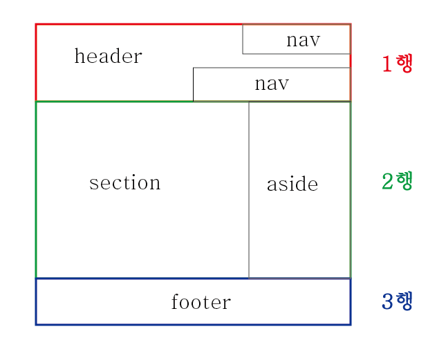
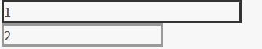
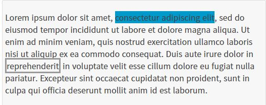
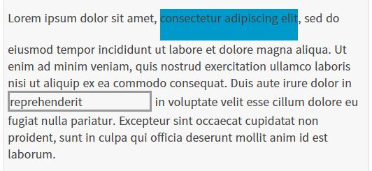

# 프론트엔드
### css
#### 기초 배우기

> CSS 이란?
+ CSS(Cascading Style Shhets)는 웹페이지를 꾸미려고 작성하는 코드
<h5> -Ex) 글자색을 검정이나 빨갛게, 콘텐츠를 화면 배치 정보 등
+ CSS는 실제로 프로그래밍 언어, 마크업 언어 X, Style sheet 언어
<h5> -HTML 문서에 있는 요소들에 선택적으로 스타일을 적용 할 수 있다는 말

> CSS rule

</img>

+ 선택자(selector)

    HTML 요소 이름(꾸밀 요소(들))

+ 선언

    color: red와 같은 단일 규칙, 꾸미기 원하는 요소의 속성을 명시

+ 속성(property)

    주어진 HTML 요소를 꾸밀 수 있는 방법

+ 속성 값

>CSS 적용

+ head에 참조
<pre>
<code>
link href="styles/style.css" rel="stylesheet" type="text/css"
</code>
</pre>

+ head 내 css코딩
<pre>
<code>
Style
 p{color: red;}
    /style
</code>
</pre>

+ body속 직접 적용

> 선택자의 여러 종류

 + 요소 선택자(태그 또는 타입 선택자)
    
    선택하는 것 : 특정 타입의 모든 HTML 요소
    
       Ex) p
+ 아이디 선택자

    선택하는 것 : 특정 아이디를 가진 페이지의 요소

      Ex) #my-id
+ 클래스 선택자

    선택하는 것 : 특정 클래스를 가진 페이지의 요소

      Ex) .my-class
+ 속성 선택자   

    선택하는 것 : 특정 속성을 갖는 페이지의 요소

      Ex) img[src]
+ 수도(Pseudo) 클래스 선택자
   
     선택하는 것 : 특정 요소이지만 특정 상태에 있을 때만, 예를 들면, hover over 상태일 때.

      Ex) a:hover

# 레이아웃 만들기

</img>
기본적인 레이아웃

## float
>float 이란?
+ 웹페이지에서 이미지를 어떻게 띄워서 텍스트와 함께 배치할 것인가에 대한 속성
>float 요소
+ inherit: 부모 요소에서 상속
+ left: 왼쪽에 부유하는 블록 박스를 생성
+ right: 오른쪽에 부유하는 블록 박스를 생성
+ none - 요소를 부유시키지 않음

-left와 right를 통해 float을 지정시 display는 무시
> 레이아웃에서의 float
+ float 속성은 원래 이미지와 텍스트 배치 용도로 등장했지만, 요즘에는 레이아웃용으로 많이 사용
<pre>
<code>
.main .left-menu{
		float: left;
		width: 50px;
		height: 254px;
		border: 2px solid red;
		background-color: #ffe7d5;
	}
	.main .content{
		float: left;
		width: 250px;
		height: 250px;
	}
</code>
</pre>
출력 결과

</img>

## position

> positon 이란?
+ 태그를 어떻게 위치시킬지를 정의
>positon 요소
+ static: 기본값, 다른 태그와의 관계에 의해 자동으로 배치되며 위치를 임의로 설정해 줄 수 없음
+ absolute: 절대 좌표와 함께 위치를 지정해 줄 수 있음
+ relative: 원래 있던 위치를 기준으로 좌표를 지정
+ fixed: 스크롤과 상관없이 항상 문서 최 좌측상단을 기준으로 좌표를 고정
+ inherit: 부모 태그의 속성값을 상속
<h5> -좌표를 지정 해주기 위해서는 left, right, top, bottom 속성과 함께 사용
<h5> -position을 absolute나 fixed로 설정시 가로 크기가 100%가 되는 block 태그의 특징이 사라짐

> position 예시
<pre>
<code>
#box1 { position: static; top: 20px; left: 30px; }
		#box2 { position: relative; top: 20px; left: 30px; }
		#box3 { position: absolute; top: 20px; right: 30px; }		
</code>
</pre>
출력결과

</img>

## display
> display 이란?
+ 요소를 어떻게 보여줄지를 결정

> display 요소
+ none : 보이지 않음
+ block : 블록 박스
+ inline : 인라인 박스
+ inline-block : block과 inline의 중간 형태

>none
+ 요소를 렌더링하지 않도록 설정
+ visibility 속성을 hidden으로 설정한 것과 달리, 영역도 차지하지 않음
> block
+ div 태그, p 태그, h 태그, li 태그 등
+ block 요소 다음에 등장하는 태그는 줄바꿈이 된 것처럼 보임
+ width, height 속성을 지정 할 수 있음

</img>

> inline
+ span 태그, b 태그, i 태그, a 태그 등
+ block 과 달리 줄 바꿈이 되지 않고, width와 height를 지정 할 수 없음

</img>

>inline-block
+ block과 inline의 중간 형태라고 볼 수 있는데, 줄 바꿈이 되지 않지만 크기를 지정 할 수 있음

</img>

## Box Model
> box model이란?
+ 모든 HTML 요소는 박스(box) 모양으로 구성되며, 이것을 박스 모델(box model)이라고 부름
+ HTML 요소를 패딩(padding), 테두리(border), 마진(margin), 그리고 내용(content)으로 구분

</img>

>box model
+ 내용(content) : 텍스트나 이미지가 들어있는 박스의 실질적인 내용 부분
+ 패딩(padding) : 내용과 테두리 사이의 간격, 눈에 보이지 않음
+ 테두리(border) : 내용와 패딩 주변을 감싸는 테두리
+ 마진(margin) : 테두리와 이웃하는 요소 사이의 간격, 눈에 보이지 않음

>height와 width
+ CSS에서 height와 width 속성을 설정할 때 그 크기가 가르키는 부분은 내용(content) 부분만을 대상

# Flex

>flex란?
+ flexible box, flex box라고 부름
+ flex는 레이아웃 배치 전용 기능으로 고안  
<h5>float나 inline-block 등을 이용한 기존 방식보다 훨씬 강력하고 편리한 기능들이 많음

>flex와 grid
+ 더 나중에 나온 스펙인 grid로도 flex와 똑같이 구현할 수 있는 경우가 많지만, grid로는 구현이 어려운 레이아웃이거나 flex를 쓰는게 더 편리한 경우도 존재
+ 지원해줘야 하는 인터넷 익스플로러같은 경우에는 flex는 표준 스펙을 지원하지만 grid는 legacy 버전만 지원하기 때문에, 적재적소에 활용하는 것이 중요

>flex 레이아웃을 만들기 위한 기본적인 html 구조
<pre>
<code>
    div class="container"
	div class="item" helloflex
	div class="item" abc 
	div class="item"helloflex 
</code>
</pre>
+ 부모 요소를 flex container
+ 자식 요소를 flex item
+ "컨테이너가 flex의 영향을 받는 전체 공간이고, 설정된 속성에 따라 각각의 아이템들이 어떤 형태로 배치되는 것"이라고 생각하면 됨
</img>

> flex 컨테이너에 적용하는 속성들
 
 display: flex;
<pre>
.container{
    display: flex;
}
</pre>
</img>

+ flex 아이템들은 가로 방향으로 배치, 자신이 가진 내용물의 width 만큼만 차지, height는 컨테이너의 높이만큼 늘어남
+ <h5>
inline-flex는 inline-block처럼 동작
 
 flex-direction
 + 아이템들이 배치되는 축의 방향을 결정하는 속성
 <pre>
.container {
	flex-direction: row;
	/* flex-direction: column; */
	/* flex-direction: row-reverse; */
	/* flex-direction: column-reverse; */
}
</pre>
</img>

+ row(기본값) : 아이템들이 행(가로)방향으로 배치
+ row-reverse : 아이템들이 역순으로 가로 배치
+ column : 아이템들이 열(세로)방향으로 배치
+ column-reverse : 아이템들이 역순으로 세로 배치 

flex-wrap
+ 컨테이너가 더 이상 아이템들을 한 줄에 담을 여유 공간이 없을 때 아이템 줄바꿈을 어떻게 할지 결정하는 속성
<pre>
.container {
	flex-wrap: nowrap;
	/* flex-wrap: wrap; */
	/* flex-wrap: wrap-reverse; */
}
</pre>
</img>

+ nowrap(기본값) : 줄바꿈 x, 넘치면 그냥 빠져 나감
+ wrap : 줄바꿈을 함
+ wrap-reverse: 줄바꿈을 하나, 아이템을 역순으로 배치

flex-flow
+ flex-direction과 flex-wrap을 한꺼번에 지정할 수 있는 단축 속성
+ flex-direction, flex-wrap의 순으로 한 칸 떼고 작성
<pre>
.container {
	flex-flow: row wrap;
	/* 아래의 두 줄을 줄여 쓴 것 */
	/* flex-direction: row; */
	/* flex-wrap: wrap; */
}
</pre>

justify-content
+ 메인축 방향으로 아이템을들 정렬하는 속성
<pre>
.container {
	justify-content: flex-start;
	/* justify-content: flex-end; */
	/* justify-content: center; */
	/* justify-content: space-between; */
	/* justify-content: space-around; */
	/* justify-content: space-evenly; */
}
</pre>
+ flex-start(기본값) : 아이템들을 시작점으로 정렬
+ flex-end : 아이템들을 끝점으로 정렬
+ center : 아이템들을 가운데로 정렬
+ space-between : 아이템들의 “사이(between)”에 균일한 간격
+ space-around : 아이템들의 “둘레(around)”에 균일한 간격
+ space-evenly : 아이템들의 사이와 양 끝에 균일한 간격, IE와 엣지에선 지원X
</img>

align-items
+ 수직축 방향으로 아이템을들 정렬하는 속성
<pre>
.container {
	align-items: stretch;
	/* align-items: flex-start; */
	/* align-items: flex-end; */
	/* align-items: center; */
	/* align-items: baseline; */
}
</pre>
+ stretch(기본값) : 아이템들이 수직축 방향으로 끝까지 쭈욱 늘어남
+ flex-start : 아이템들을 시작점으로 정렬
+ flex-end : 아이템들을 끝으로 정렬
+ center : 아이템들을 가운데로 정렬
+ baseline : 아이템들을 텍스트 베이스라인 기준으로 정렬

align-content
+ flex-wrap: wrap;이 설정된 상태에서, 아이템들의 행이 2줄 이상 되었을 때의 수직축 방향 정렬을 결정하는 속성
<pre>
.container {
	flex-wrap: wrap;
	align-content: stretch;
	/* align-content: flex-start; */
	/* align-content: flex-end; */
	/* align-content: center; */
	/* align-content: space-between; */
	/* align-content: space-around; */
	/* align-content: space-evenly; */
}
</pre>
> flex 아이템에 적용하는 속성들

flex-basis
+ Flex 아이템의 기본 크기를 설정(flex-direction이 row일 때는 너비, column일 때는 높이)
+ 기본값 auto는 해당 아이템의 width값을 사용

flex-grow
+ 아이템이 flex-basis의 값보다 커질 수 있는지를 결정하는 속성
+ 숫자값이 들어가며, 0보다 큰 값이 세팅이 되면 해당 아이템이 유연한(Flexible) 박스로 변하고 원래의 크기보다 커지며 빈 공간을 메우게 됨

flex-grow: 0;
</img>
flex-grow: 1;
</img>

+ flex-grow에 들어가는 숫자의 의미: flex-basis를 제외한 여백 부분을 flex-grow에 지정된 숫자의 비율로 나누어 가짐.
<pre>
/* 1:2:1의 비율로 세팅할 경우 */
.item:nth-child(1) { flex-grow: 1; }
.item:nth-child(2) { flex-grow: 2; }
.item:nth-child(3) { flex-grow: 1; }
</pre>
</img>

flex-shrink
+ 아이템이 flex-basis의 값보다 작아질 수 있는지를 결정
+ 숫자값이 들어가는데, 몇이든 일단 0보다 큰 값이 세팅이 되면 해당 아이템이 유연한(Flexible) 박스로 변하고 flex-basis보다 작아짐
+ 기본값이 1이기 때문에 따로 세팅하지 않았어도 아이템이 flex-basis보다 작아질 수 있음

flex-shrink: 1;
</img>
flex-shrink: 0;
</img>

flex
+ flex-grow, flex-shrink, flex-basis를 한 번에 쓸 수 있는 축약형 속성

align-self
+ 해당 아이템의 수직축 방향 정렬
+ 기본값은 auto로, 기본적으로 align-items 설정을 상속
+ align-self는 align-items보다 우선권

order
+ 각 아이템들의 시각적 나열 순서를 결정하는 속성
<pre>
<code>
 .item:nth-child(1) { order: 3; } /* A */
.item:nth-child(2) { order: 1; } /* B */
.item:nth-child(3) { order: 2; } /* C */
</code>
</pre>
</img>

z-index
+ z-index로 Z축 정렬
+ 숫자가 클 수록 위로 올라옴
+  z-index를 설정 안하면 0

# Grid

>gird?
+ Grid는 두 방향(가로-세로) 레이아웃 시스템 (2차원)
</img>
+ flex보다 더 복합적인 레이아웃 표현이 가능

> Grid 레이아웃을 만들기 위한 기본적인 HTML 구조
<pre>
<code>
div class="container"
	div class="item" A
	div class="item" B
	div class="item" C
	div class="item" D
	div class="item" E 
	div class="item" F
	div class="item" G
	div class="item" H
	div class="item" I

</code>
</pre>
+ 부모 요소인 div.container를 Grid Container(그리드 컨테이너)
+ 자식 요소인 div.item들을 Grid Item(그리드 아이템)
+ “컨테이너가 Grid의 영향을 받는 전체 공간이고, 설정된 속성에 따라 각각의 아이템들이 어떤 형태로 배치되는 것”이라고 생각

<pre>
<code>
.container {
	display: grid;
}
</code>
</pre>
> 용어정리
</img>