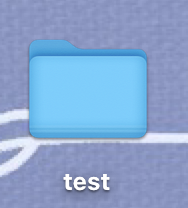
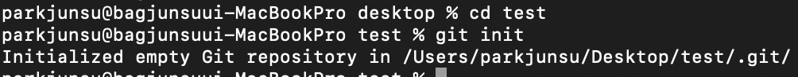
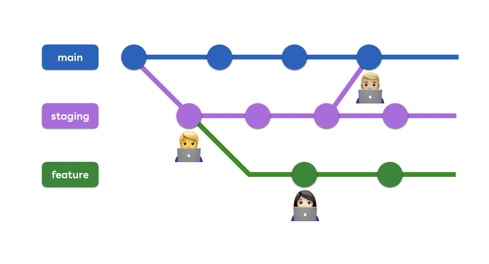
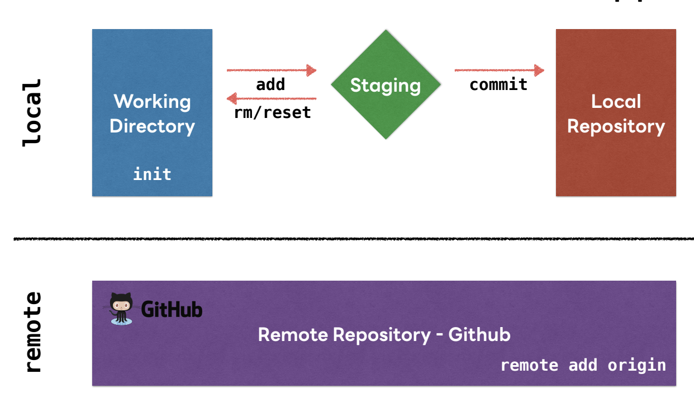
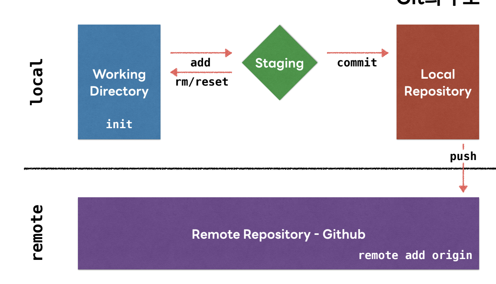

# github과 git명령어

> github을 왜 써야 해?
1. 우리가 알고 있던 파일 시스템으로는 안정적이고 일관성 있는 관리가 쉽지 않다.
2. 저장소에 저장된 소스의 <u>변경사항</u>과 <u>작업자</u>를 추적한다.

> 제 개인적인 github을 써야 하는 이유

1. 개인 포토폴리오
    + 개인 프로젝트 , 팀 프로젝트 등 개발이력을 보관 및 pr
2. 팀 프로젝트 및 팀 개발활동
    + 개인 개발 및 병합, 수정에 있어서 용이

> git과 github이란?
+ git은 github이다? 
 => 동일하면서도 다르다!
    + git은 소스 이력 추적을 위한 버전 관리 시스템
     <b>개인 컴퓨터</b>에서 돌아가는 Version Control System
     Git을 사용하기 위해서 개인 계정을 등록할 필요도 없으며 인터넷을 연결할 필요도 없다.
    + github은 git프로젝트을 관리하는 저장소 제공
     <b>github라 불리는 회사에서 서비스하고 있는 서버</b>에 올라간 git
     개인 계정을 등록해야 하며, 인터넷에 연결되어야 사용할 수 있다.

>Git의 구조

+ Working Directory : 현재 작업 중인 프로젝트가 위치한 디렉토리
+ Staging : commit 할 파일의 예비 저장소 
+ Local Repository : 각 컴퓨터의 git이 관리하는 로컬 저장소
+ Remote Repository - github : github 등 외부에 위치한 저장소

-----------------
### 로컬 Git 저장소 생성 

> git init

 

+ 프로젝트로 쓸 폴더를 생성 
 

 

+ 터미널을 사용하여 폴더를 열고 git init 사용
> git add
+  git add . : staging에 전체 추가
+  git add "<파일명>" : 파일 추가
> git rm 
+ git rm "<파일명>" : 파일 삭제

>git commit 
+ git commit -m “< message>”
    + 메시지는 확실하게!, 애매모호한 표현x 
    + ex: 로그인 버튼 추가 / 깃헙 사용법 md 작성 
+ 로컬 저장소에 변동 기록을 남기기 위해 commit을 실행     
+ commit을 통해 새로운 버전을 git에 등록 
+ message를 남기는 이유?
    + commit에 대한 정보 기록!   

> main과 branch

+ main / master
    + 즉시 운영 배포할 수 있는 버전
    + 사용자가 지금 이용 중인 코드
+ staging
    + 상용에 반영하기 전 테스트 버전
+ feature
    + 새로운 기능 추가 개발(병렬 작업)    
------------
### Github에 소스 반영

> git remote add origin <원격저장소 주소>
+ 로컬 저장소의 프로젝트를 원격 저장소에 반영

> git push -u origin <브랜치명>

+ push -u 를 하면 향후 추가적인 push 작업시에는 git push로만 가능
