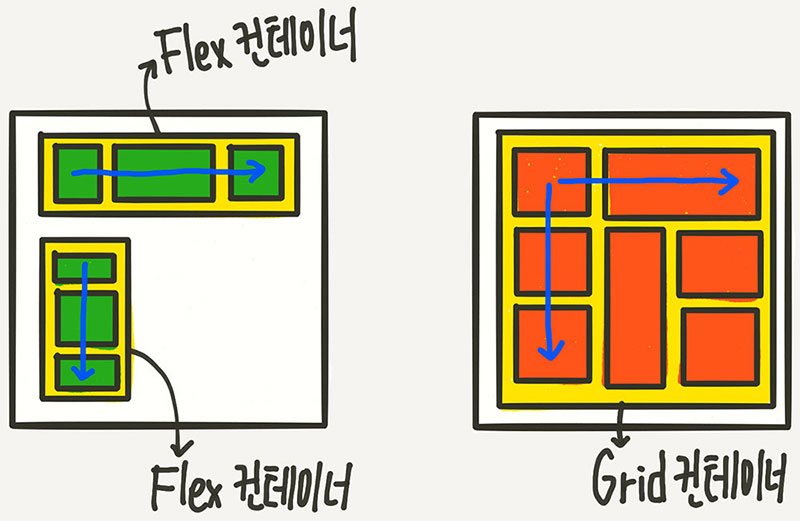
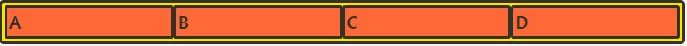

# Grid

>gird?
+ Grid는 두 방향(가로-세로) 레이아웃 시스템 (2차원)
</img>
+ flex보다 더 복합적인 레이아웃 표현이 가능

> Grid 레이아웃을 만들기 위한 기본적인 HTML 구조
<pre>
<code>
div class="container"
	div class="item" A
	div class="item" B
	div class="item" C
	div class="item" D
	div class="item" E 
	div class="item" F
	div class="item" G
	div class="item" H
	div class="item" I

</code>
</pre>
+ 부모 요소인 div.container를 Grid Container(그리드 컨테이너)
+ 자식 요소인 div.item들을 Grid Item(그리드 아이템)
+ “컨테이너가 Grid의 영향을 받는 전체 공간이고, 설정된 속성에 따라 각각의 아이템들이 어떤 형태로 배치되는 것”이라고 생각

<pre>
<code>
.container {
	display: grid;
}
</code>
</pre>
> 용어정리

</img>

+ 그리드 컨테이너 (Grid Container) : 'display: grid'를 적용하는, Grid의 전체 영역
+ 그리드 아이템 (Grid Item) : Grid 컨테이너의 자식 요소
+ 그리드 트랙 (Grid Track) : Grid의 행(Row) 또는 열(Column)
+ 그리드 셀 (Grid Cell) : Grid의 한 칸을 가리키는 말
+ 그리드 라인(Grid Line) : Grid 셀을 구분하는 선
+ 그리드 번호(Grid Number) : Grid 라인의 각 번호
+ 그리드 갭(Grid Gap) : Grid 셀 사이의 간격
+ 그리드 영역(Grid Area) : Grid 라인으로 둘러싸인 사각형 영역으로, 그리드 셀의 집합

display: grid;
+ <h5> inline-grid도 있는데, 이건 block과 inline-block의 관계를 생각

grid-template-rows,/
grid-template-columns
+ 컨테이너에 Grid 트랙의 크기들을 지정해주는 속성
+ grid-template-rows는 행(row)의 배치
+ grid-template-columns는 열(column)의 배치
+ <h5> fr: 비율 
+ 고정 크기와 가변 크기를 섞어 쓸 수도 있음
+ repeat 함수
<h5>repeat(반복횟수, 반복값)
+ minmax 함수: 최솟값과 최댓값을 지정할 수 있는 함수
+ auto-fill과 auto-fit: column의 개수를 미리 정하지 않고 설정된 너비가 허용하는 한 최대한 셀을 채움
<pre>
<code>
.container {
	grid-template-columns: repeat(auto-fill, minmax(20%, auto));
}
</code>
</pre>
auto-fill
</img>
 auto-fit
</img>

row-gap, column-gap,gap
+ 그리드 셀 사이의 간격을 설정

