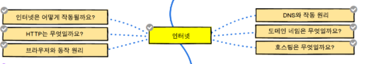

# WEB Frontend Lordmap
----------------------
### 웹 개발자
---------------

> __인터넷__
+ 인터넷은 어떻게 작동될까요?   
  + 인터넷이란?   
 정보를 담은 각 컴퓨터를 TCP/IP 통신 프로토콜을 이용하여 연결하여 서로 정보를 주고 받도록 한 컴퓨터 네트워크
 
    두개의 컴퓨터간의 통신      
 간단하게 두개의 컴퓨터가 통신이 필요할때 물리적 또는 무선으로 연결

+ HTTP는 무엇일까요?   
ㄴㅇㄴㅇ
+ 브라우저와 동작 원리   
ㄴㅇㅁㅇ
+ DNS와 작동 원리   
ㄴㅇ
+ 도메인 네밈은 무엇일까요?   
ㄴㅇ
+ 호스팅은 무엇일까요?   

